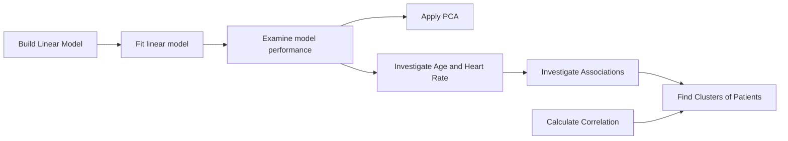

# Improving Maternal Health Outcomes
## Context 
The health of women throughout pregnancy, childbirth, and the postpartum period is referred to as maternal health. Despite significant advancement over the past 20 years, 295 000 women died during or after pregnancy and childbirth in 2017. 
This number is unacceptably high. In addition to indirect factors including anaemia, and malaria, the most frequent direct causes of maternal injury and death are excessive blood loss, infection, and high blood pressure.
Most maternal deaths are preventable with timely management by skilled professionals working together across different disciplines. 

## Report: Analysis of Blood Pressure Data

1) Building a Linear Model
To build a linear model, we assume the response variable is Systolic BP (blood pressure), and the exploratory variable chosen is age.
We select age as the exploratory variable because it is a common factor known to influence blood pressure. 
By examining the relationship between age and systolic blood pressure, we can gain insights into how age affects blood pressure levels.

2) Principal Component Analysis (PCA):
To reduce the number of variables, we apply Principal Component Analysis (PCA). 
PCA is a dimensionality reduction technique that helps identify the most important components or patterns in the data. 
By transforming the original variables into a new set of uncorrelated variables called principal components, we can reduce the complexity of the data while retaining the most critical information.

3) Relationship between Age and Heart Rate by Age Grouping:
To investigate the relationship between age and heart rate, we group the data into age intervals and calculate the mean heart rate for each group.
We choose age intervals based on meaningful divisions that capture different stages of life or clinical significance.
Graphical representation, such as a bar plot or line plot, can help visualize the relationship between age groups and heart rate.

4) Associations between Diastolic and Systolic Blood Pressure:
To investigate associations between pairs of high/high, normal/normal, and low/low diastolic and systolic blood pressure.
5) Clusters of Patients with Similar Systolic BP:
To identify clusters of patients with similar systolic blood pressure, we can use clustering algorithms such as k-means or hierarchical clustering. 
These algorithms group patients based on their similarities in systolic blood pressure values. 
By examining the clusters, we can gain insights into different patterns or subgroups within the dataset and potentially identify factors that contribute to similar systolic blood pressure levels.

6) Correlation between Age and Systolic BP:
To calculate the correlation between age and systolic blood pressure, we can use a statistical measure such as Pearson's correlation coefficient.
The correlation coefficient quantifies the strength and direction of the linear relationship between age and systolic blood pressure.

## Recommendation
From the analysis the following suggestion can made to the medical agency to help improve 
the maternal health development:
* The blood pressure should be monitored regularly, mostly within women of advance 
maternal age.
* The heart rate of patient within advance maternal age should be monitored frequently.
* The blood sugar level of patients should be monitored because it can affect the 
systolic blood pressure of the patients.
* Additional risks factors such as medical history, diet and lifestyle should be 
considered in predicting maternal health

